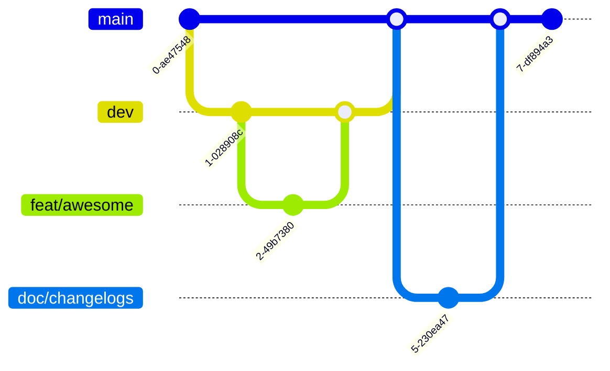

# 如何创建一个新项目
本文档对如何开启一个新的工程项目进行了相应的规定

> 短语与词汇表
> - **TL;DR**: Too long, don't read, 一般是内容摘要的标题
> - **LGTM/SGTM**: Look/Sound good to me, 表示没有进一步的意见
> - **IMHO**: In my humble opinion, 表示带有主观色彩的意见
> - **Repo**: repository的缩写, 表示代码库
> - **package**: 一般表示Python依赖的库
> - **issue/thread**: 讨论帖子, issue一般出现在代码管理平台, thread一般用于论坛和讨论
> - **branch**: 开发分支
> - **PR**: pull request, 在Gitlab中也称为MR(merge request), 用于将分支合并到开发主干中
> - **CR**: Code Review, 代码审查, 一般和PR同步发生.
> = **TestCase**: 测试样例, 一般是一个独立无依赖的运行脚本, 其目的是对项目中的**一个**功能进行测试和说明.

## TL;DR

1. 项目组织三原则: 充分沟通, 进度可追溯, 最小阻力
1. 使用模板创建项目 (根据语言选择: [Python](https://github.com/rochacbruno/python-project-template)), 并参考相应的风格指南[^1]
1. 在开发前, 使用issue创建相关的讨论
1. 使用PR合并新增代码
1. 功能与测试同步
1. 对照checklist进行自查


## 原则

每个项目/Repo的创建者默认是该项目的Owner, 对该项目的进度和结果负责. Owner在推进的过程中, **必须**遵循下述三原则:

### 充分沟通

在开发前, 应和相关同学充分沟通设计的想法和方案, 确保所有参与者都有一样的上下文. 一般而言, 需要沟通的内容包括:
- 定义. 最常见的误解是参与者之间存在对同一名词/方法/场景的不同理解. 通过描述具体化的案例和方案有助于大家对齐定义.
- 目标结果. 对于项目的目标结果, 即该项目 `是什么` 而 `非什么` 是讨论中常见的误区. **对于并非项目想要解决的问题, 不应该在项目讨论中出现**. 对于此项内容, 项目的Owner应按照自身能力和资源对其进行限制, 参与者在对该项内容提出意见时, 应该指出满足能力/资源限制的相应办法.
- 优先级. 对于工作的优先级, 一般由Owner指定. 当参与者存在意见分歧时, 最终决定权在Owner, 但较为重要的不同意见应建立相应的issue作为提醒.

沟通的流程遵循由整体到局部的顺序, 在开发过程中循环进行. 一般在项目建立初期, 仅需要对大的目标和架构设计进行讨论, 不应过早讨论相应技术选型和实施细节.

### 进度可追溯

进度可追溯是对充分沟通原则的进一步扩展. 这一原则要求, 不仅对于当前时间点上的参与者, 对于未来可能的参与者, 也应可以简单地获取项目发展的上下文信息, 从而了解到项目想要解决的问题, 当时各参与者对该问题的意见, 以及最后选择的开发路径.

### 最小阻力

在满足上述两原则的基础上, Owner应选择最小阻力的路径进行项目推进, 即在当前能力/资源水平下, 可以最快完成相应功能的技术路径应该被优先选择. 但相关的讨论及未来升级点应提前讨论, 并留存相关资料, 在架构上预留抽象和接口.

在大部分时候, 上述三原则都是围绕着同一目标:界定清楚问题, 聚合大家的力量完成工作. 但在有些情况下, 这些原则间可能会有冲突, 例如, 在项目开始阶段, 充分沟通的原则和最小阻力原则会有所冲突, 因为此时可能并未产生足够的上下文来支撑大家开展沟通. 一个简单的处理方法是由负责人简要描述项目目的和内容, 其余参与者补充希望进一步沟通的内容.


## 开发流程

> 我们的开发流程以 Git[^2] 为主, 请了解基本的 Git 操作后继续本教程


### 设计与讨论
Owner应在开始前, 创建相应issue并@相关人员进行讨论. 项目创建时应具备的讨论至少包括:
- 项目目的. 为什么要做, 做完期望得到什么结果?
- 开发排期. 重要的时间节点和相应需要配合的人员.
- 技术选型. 哪些部件使用第三方工具, 哪些使用自行开发的组件;
- 项目架构. 项目的组织架构, 重点是系统状态图和类结构图;

> 例子: 一种自动化的摸鱼系统.
> 目的与排期: 构建一套用于在办公室摸鱼的系统, 以便提高空闲时间利用率. 交付内容包括一套SDK, 一套部署在本地的服务器, 并将相关成果形成论文. 预期SDK完成时间0229, 部署完成时间0230(owner: 小红), 论文完成时间0231(Owner: 小红帽), 需要服务器管理员老王配合.
> 技术选型: 使用docker-compose进行管理, 底层执行使用C++, 使用pybind向上暴露Python接口. 其中, 数值计算部分直接调用eigen, 算法实现包括XXX, YYY. 模块间通信使用gRPC+PB.
> 项目架构: 摸鱼机器人 -- C++/pybind --> 摸鱼算法库 


一般情况下, 请使用社区通用的模板创建任务, 例如[python-project-template](https://github.com/rochacbruno/python-project-template). 如果模板不满足需要或过于复杂, 请在组内仓库创建新的模板.
### 功能开发

### Git flow

我们采用以`dev`分支为核心的开发流程, 过程见下图:



上图描述了一个一般性的Git flow, 开发者从dev分支创建一个`feat/awesome` 分支进行开发, 在开发完成后通过PR将其合并至`dev`分支. 在所有功能点开发完毕后, `dev`被合并至`main`分支, 并由Owner创建相应的changelogs说明此次发版所更新的内容.

注意开发分支需要增加前缀以便后期进行过滤, 目前允许的关键词有:
- `feat`: feature, 功能开发分支
- `bug`: bug, 没有增加新功能, 仅修复bug
- `doc`: 增加文档, 一般是changelog及原理说明等大段文本, 此外的其它文本尽量和feat一起提交

由于目前没有生产环境任务, 暂不是用`hotfix`等前缀.

开发中, 请尽量遵循以下原则:
- 及时commit. 当一个相对完整的组件(例如一段函数)完成后, 及时commit, 以便后期追踪;
- 及时PR. 每次PR时, 尽可能只包括一个修改点, 修改文件数不超过5个, 改动行数不超过300行(此处指Python开发)为宜. 特殊情况, 需要在PR中说明原因, 并指出需要reviewer重点查看的文件;

### PR与CR

PR与CR是项目重要的交流手段, Owner和Reviewer都需要高度重视CR质量. 一次好的CR一般有以下特征:
- **及时**: Reviewer应在一个工作日内进行反馈, 如无法及时review应向开发者反馈, 并指定替代的reviewer.
- **友善**: Reviewer应在充分了解开发者的前提下进行评论, 评论的目的是提升开发质量, 同时也要考虑到客观上时间/经验/资源方面的限制, 避免做出过高的要求.
- **充分**: 开发者应在PR中充分说明该PR完成的任务和想要达到的目的, Reviewer围绕任务和目的进行评论.

### 文档与测试
文档与测试有助于其他参与者了解主力开发者的思路, 从而便于提供帮助. 编写文档与测试时应遵循如下原则:
- 测试与代码为主. 尽量减少独立文档(大段单独注释, 文档文件等)的必要性, 说明应主要构成应为:
  1. 良好命名的变量, 函数与模块, 该部分主要说明功能的实现原理;
  2. 清晰可用的测试样例, 该部分主要说明功能的调用方法;
- 独立文档的内容应完整. 每个独立文档本身应自成体系, 包含相关原理的介绍, 调用方法说明以及典型样例;
- 测试样例应独立. 每个测试样例需要尽可能孤立被测试功能, 在出现功能依赖时, 使用mock对依赖功能进行隔离是较为常见的办法. 在无法隔离或隔离代价较大时, 应在testcase的docstring中说明依赖关系.

## Checklist
请在开发过程中不定时检查一下方面是否有做到:

#### 项目创建时
- [ ] 使用 template 创建项目
- [ ] 代码中主代码, 文档, 测试进行了分离
- [ ] 配置了运行项目需要的文件, 如requirements.txt
- [ ] 创建了dev分支, 并对main/dev分支进行了保护

#### 功能开发前
- [ ] 创建issue对核心方法进行了讨论

#### 功能开发中
- [ ] 遵循了少量开发, 多次PR的方法
- [ ] 对每个主要功能都创建了相应的testcase

#### 功能开发后

- [ ] 是否创建了相应的文档


### 项目开发规范
- 文件结构：
  - 开发文档：放在./docs目录下
  - 单元测试：放在./tests目录下
  - 示例文件：放在./examples目录下
  - 模块文件：放在./ProjectName/project-name目录下,eval,module,data相关文件夹放在该目录下。 

- 添加单元测试：通常放在./tests目录下，每个功能开发完成后，需要进行相应模块的单元测试（test_xx.py），使用make test全部通过之后再提交。
- 项目入口：项目的入口使用entry.py, 一个repo只有一个entry。
- 模块开发（Module）：根据任务优先级进行模块开发，从最简单的任务，最确定的模块开始，不确定模块的开发放到最后。函数命名应该是有意义的，每一个函数的参数需要添加type hint(使用from typing import xxx 导入相应的类型)。对于某个功能的具体实现逻辑应通过函数和参数名来体现, 一般不添加注释，但是关于事务逻辑思考部分需要添加注释。
  ```python
      from typing import List, Dict
      def linear_interpolation(start_point: List, end_point: List, interpolate_number: int) -> Dict
        """
        linear interpolation equation:
          y(x) = y_1 + (x-x_1)\frac{y_2-y_1}{x_2-x_1}
        """
        linear_interpolation_dict = dict()
        linear_interpolation_dict['x'] = np.linspace(start_point[0], end_point[0], interpolate_number)
        linear_interpolation_dict['y'] = start_point[0] + (linear_interpolation_dict['x'] - start_point[0]) * (end_point[1] - start_point[1]) / (end_point[0] - start_point[0] + 1e-9)
        return linear_interpolation_dict
  ```
- .gitignore使用[gitignore](https://www.toptal.com/developers/gitignore)网站生成。
- 大型的数据文件不要上传到github，先生成一个空白文件就好，上面写好文件找谁要。
- 关于class的问题： 不要增加没有意义的模块. 只有当需要被多个模块继承功能, 或需要限制继承模块的实现方法(即需要添加@abstractmethod)时才需要写base_cls.py。
- 尽量不要写冗余代码，功能相似的代码需要合并到一起。但是也不要太过于抽象，变成参数只剩下(args,kwargs)。

### PR流程规范及常见问题
第一个pr介绍项目结构和完善readme文件，第二个pr是定义数据类型，第三个pr提交一个完整功能的demo。当写一个demo的时候，很多功能没有写完，先写一个函数名，函数体部分写raise NotImplemented即可:
```python
def simulate():
  raise NotImplemented

```
如果要进行Mock测试的时候,某些函数没有实现,就随机生成这个模块的值,然后传递给其他模块:
```python
def load_network_data():
    # 假设这个函数用来载入已经生成好的路网文件,但是现在路网文件没有,那么你就随机生成一个,或者说写一个静态的路网文件返回出去 
    static_network_data = {'xxx': 'xxx'}
    return static_network_data

def generate_world():
    # 已经实现的函数
    ...

generate_world(load_network_data())
```

后继的PR是功能开发性质, 开发顺序的选取要按照从确定到不确定的顺序安排. 例如读取文件的功能, 实现方法和功能需求都比较明确, 需要优先开发. 算法模块的实现和需求都不明确, 那么就延后开发.
 - 开发的时候不断提交PR，包含[WIP]的PR会自动阻塞合并，因此需要将[WIP]关键字删除，然后合并。保证每一个pr在一个工作日之内完成，当提出pr的那一刻，半天到一天时间内需要完成review。
 - 在一个comment中如果已完成修改需要resolve conversation。
 - 合并pr到dev上面并及时删除当前分支。在其他同事的库中提交pr需要从别人的分支上产生新的子分支，并且pr到别人的分支上，只有在很小的改动的时候，才可以这么做。
 - pr上传的时候，每次只仅仅上传一个功能，尽可能就3-5个文件。
 - 从模板中创建自己的项目的时候，需要将模板中一些原本的文件删除掉。创建main分支和dev分支之后，需要将其设置成protect模式。

## 更多建议?
本文档为**强制性**规范, 组内所有的开发流程都应遵循上述要求的基本原则. 虽然我们参考了业内的最佳实践来制定本规则, 但在开发过程中你可能还是会发现存在问题, 例如:
- 要求是否过于繁琐以至于降低了开发效率?
- 是否经常有突发情况导致没有足够时间进行CR?
- 有新的自动化工具推荐?

欢迎创建issue添加新的内容和讨论!

[^1]: [Python 风格指南](https://zh-google-styleguide.readthedocs.io/en/latest/google-python-styleguide/contents/)
[^2]: [快速入门，玩转Git](https://juejin.cn/post/7000366994860179486)